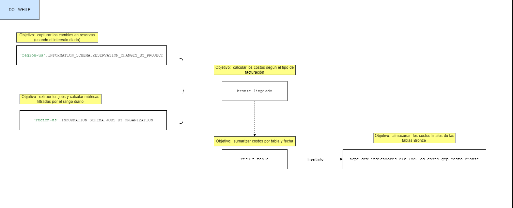
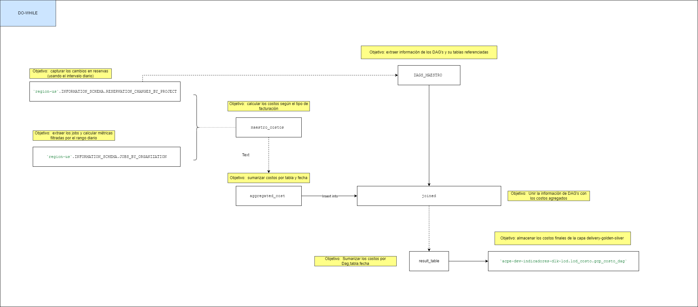
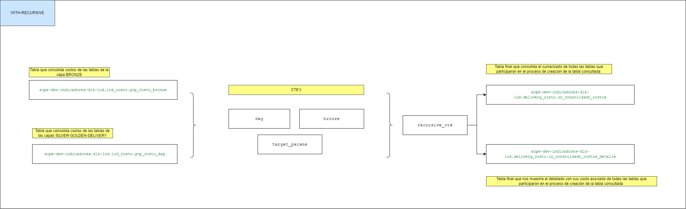
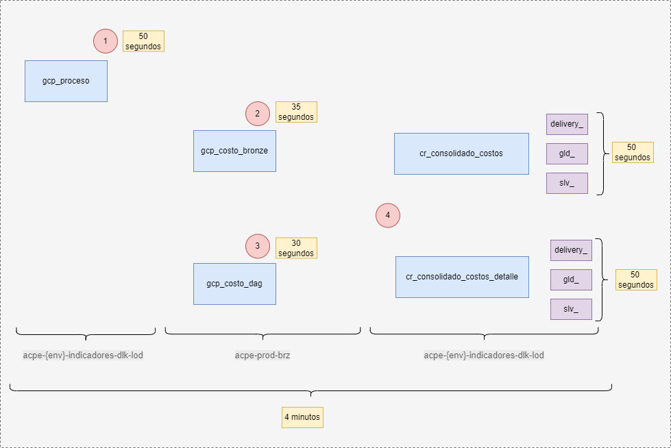

# Calculadora de Costos

## Propósito General

El objetivo principal de este proceso es integrar y cruzar información proveniente de distintas vistas de metadata que nos proporciona **BigQuery** para obtener un análisis detallado de la creación de tablas y su relación con los costos asociados. En concreto, se busca:

- **Asociar Metadata y Costos:**  
  Unir datos de ejecución de jobs (con sus respectivos costos y métricas) con la metadata de los DAGs de Airflow que generan estas tablas.

- **Distribución del Costo:**  
  Determinar la cantidad de veces que una tabla de origen es utilizada en la creación de diferentes tablas (concurrencia) y prorratear el costo total asociado en función de dicho uso.

- **Optimización y Transparencia:**  
  Proveer una visión integral que facilite la evaluación del uso de recursos, permitiendo optimizar y ajustar los procesos de transformación y creación de tablas en el entorno de BigQuery.

---

## BigQuery

El proceso se estructura en varios componentes clave dentro de BigQuery:

### 1. Extracción de Datos

- Se utilizan las vistas de:
  - `INFORMATION_SCHEMA.JOBS_BY_ORGANIZATION`
  - `INFORMATION_SCHEMA.RESERVATION_CHANGES_BY_PROJECT`

  para capturar datos sobre los jobs ejecutados y los cambios en reservas, respectivamente.

### 2. Transformación mediante CTEs

Se definen **CTEs (Common Table Expressions)** para modularizar la lógica:

- **reservation_slot:**  
  Captura los cambios en reservas en un rango de fechas.

- **jobs:**  
  Extrae y calcula métricas básicas de los jobs (como bytes facturados, duración y slots utilizados).

- **maestro_costos:**  
  Calcula los costos asociados a cada job, diferenciando entre modos de facturación.

- **DAGS_MAESTRO:**  
  Extrae la metadata de los DAGs, identificando:
  - `dag_id`
  - La tabla creada
  - Las tablas origen involucradas.

### 3. Integración y Análisis

- **Unión de Datos:**  
  Se realiza la unión de la información de costos con la metadata de los DAGs mediante una llave de cruce (tabla creada / `table_path_id`).

- **Cálculo de Concurrencia y Prorrateo:**  
  Se aplican funciones de ventana para:
  - Calcular la concurrencia de uso de cada tabla de origen.
  - Calcular el costo prorrateado (dividiendo el costo total entre el número de usos).

## Proceso Bronze

Este proceso nos permite capturar los costos asociados a las tablas de bronze-prod por día.  

## Proceso Silver-Golden-Delivery

Este proceso nos permite capturar los costos asociados a las tablas silver-golden-delivery por día.

## Proceso Generación Calculadora

Este proceso nos permita aplicar una lógica recursiva para obtener la trazabilidad en términos monetarios de una tabla final 
con las tablas que participaron en su creación.  Se tiene el consolidado por tabla , asi como el detallado.

## Diagrama de Secuencia

## Código Fuente (Nueva capa Lod)

- [Capa Lake Operation Data](https://github.com/Alicorp-Digital/acpe-dlk-repo-lod)

