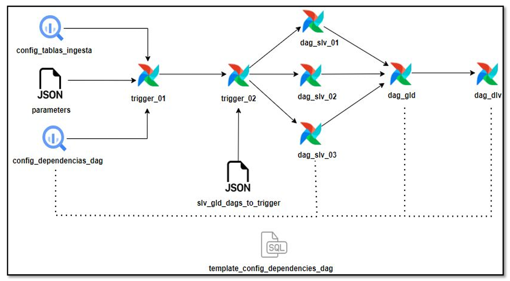

# Dag - Execution

**Datalake**  
**Agosto 2023**

---

## Índice

1. [Diagrama de Funcionamiento](#diagrama-de-funcionamiento)
2. [Diagrama de Registro de Nuevo DAG](#diagrama-de-registro-de-nuevo-dag)
3. [Archivo Parameters y Tablas de Ingesta - Dependencia](#archivo-parameters-y-tablas-de-ingesta---dependencia)
4. [Archivo Maestro de DAGs](#archivo-maestro-de-dags)

---

## Diagrama de Funcionamiento



1. El proceso inicia con la ejecución automática del **dag trigger_01**. Para ello, se apoya en la información de las tablas `config_tablas_ingesta`, `config_dependencias_dag` y en el archivo `parameters.json`.

2. Una vez terminado el trigger_01 (lógica de dependencias de dag), se ejecuta el **dag trigger_02**. Este dag realiza la ejecución en orden, según las dependencias de dag y por ambiente (silver, golden y delivery).

---

## Diagrama de Registro de Nuevo DAG


1. Se debe registrar la dependencia entre dags en el archivo `parameters.json` en el modelo nuevo.

2. Luego se deben registrar las tablas que se crearon, ya sea en el ambiente **silver**, **golden** y **delivery**, y las tablas que se usen del ambiente **bronze** en la tabla `config_tablas_ingesta`. En la tabla `config_dependencias_dag` se registra el nuevo dag y las tablas del ambiente anterior que se necesitan para que el dag se ejecute.

3. Finalmente, se registra el nombre del nuevo dag en el archivo `slv_gld_dags_to_trigger`.

---

## Archivo Parameters y Tablas de Ingesta - Dependencia


En este archivo JSON se registran las dependencias entre dags. Solo se registra el nombre del dag, ya sea del mismo ambiente o del ambiente anterior, en la parte de `dag_dependencies`. Se toma como ejemplo el dag de *gld cliente*.

### Ejemplo de Registro en el Archivo Parameters

El dag del ambiente **golden**, para que se ejecute correctamente y con la data actualizada, depende de 3 dags del ambiente anterior que es **silver**:

- `alicorp-pe-gtm-digitales-{env}-slv-modelo-cliente`
- `alicorp-pe-gtm-digitales-{env}-slv-modelo-producto`
- `alicorp-pe-gtm-digitales-{env}-slv-modelo-ventas`

Podría ser que también dependa de otro dag del ambiente **golden**. En ese caso, se debe registrar también el nombre del dag en la parte de `dag_dependencies`.

#### ¿Dónde se encuentra el Archivo?

- El archivo se encuentra en la carpeta `dml` del modelo que se está desarrollando.  
- Debe ser creado tomando como referencia el archivo de otro modelo.  
- Todo se trabaja a través de GitHub, donde se pueden encontrar los proyectos de **Bronze**, **Silver** y **Golden** y guiarse de los modelos existentes.

---

## Tabla de Ingesta

Esta tabla contiene todos los nombres de las tablas que se usan en los dags, ya sean de **bronze**, **silver**, **golden** y **delivery**. Funciona como una tabla de monitoreo, ya que permite conocer qué tablas se usan en el Datalake.

### Funcionamiento según Ambiente

1. Si se ejecuta un dag de **silver**, la tabla contiene las tablas de **bronze** y **silver** que usa el dag.
2. Si se ejecuta un dag de **golden**, contiene tablas de **silver** y **golden**.
3. Si se ejecuta un dag de **delivery**, contiene tablas de **golden** y **delivery**.

### Estructura de la Tabla de Ingesta

- Nombre del dataset
- Nombre de la tabla
- Identificador de la tabla
- Estado de actualización de la tabla
- Estado de la tabla después del proceso de actualización
- Indica si la cantidad incrementó
- Campo usado como flag
- Fecha de actualización de la tabla
- Cantidad de registros
- Variación de cantidad
- Indica si la tabla se cargó correctamente
- Plataforma a la que pertenece la tabla

#### Ejemplo de Insert

```sql
INSERT INTO `acpe-prod-brz.PROD_CONFIG.config_tablas_ingesta` 
VALUES('PROD__SAPS4','t001k','',true,true,false,false,CURRENT_TIMESTAMP(),0,0,true,'SAPS4');
```

# Campos indispensables

- **Dataset**
- **Table_name**
- **Status_last_ejecution**  
  - Si el valor es `true`, no es necesario validar la fecha de la tabla en el campo `last_ejecution`.
  - Si es `false`, se debe validar que la fecha en `last_ejecution` esté actualizada.
  - Este campo es esencial para la ejecución del DAG en *silver*; para *golden* y *delivery* puede ir en `true`.
- **Last_ejecution**  
  Indica la fecha de actualización de la tabla, con valor por defecto `CURRENT_TIMESTAMP()`.
- **Plataforma**
