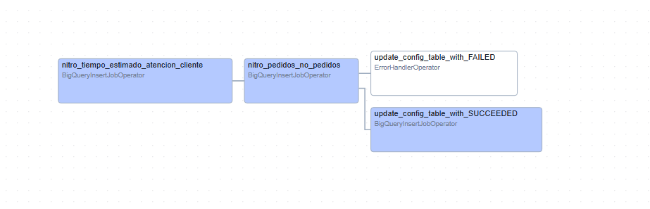
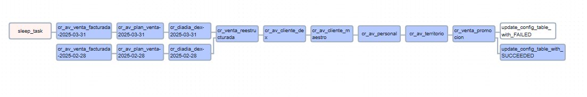
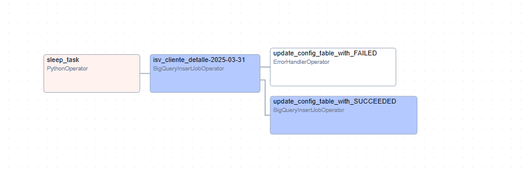

# Plantillas Clásicas

#### Propósito General

Orquestar la ejecución de scripts SQL en BigQuery para procesar datos relacionados con un modelo de caso de uso Alicorp. Los datos fluyen a través de 3 capas:

- **SLV (Silver):** Transformaciones iniciales y limpieza.
- **GLD (Gold):** Enriquecimiento y agregaciones.
- **DLV (Delivery):** Datos finales para consumo.

---

## Tipos

### [Carga Completa](#carga-completa)
##### Descripción
**Definición:**  
Plantilla utilizada para realizar la carga total de la entidad sin aplicar filtros de tiempo, garantizando una copia íntegra de la capa anterior.

**Objetivo:**  
- Asegurar la integridad de la información.  
- Empleada en la **capa Silver** y en los maestros de la **capa Golden**.

##### Funcionamiento
**Proceso:**  
  Se ejecuta un script SQL donde se reemplazan las variables definidas en `parameters` para efectuar una carga total.
  
**Características:**  
  - Cada _task_ generado es único.  
  - Garantiza la ejecución íntegra del script configurado.

#### Grafo

---

### [Carga Mixta](#carga-mixta)

##### Descripción
**Definición:**  
Plantilla que integra la carga completa y la carga por partición, ideal para DAGs que incluyen tanto maestros como datos transaccionales.

**Objetivo:**  
- Prevenir la duplicación de la carga de maestros.  
- Mantener la integridad y sincronización de la información en entornos híbridos.

##### Funcionamiento
**Proceso:**  
  Se ejecutan inicialmente los _tasks_ basados en particiones y, posteriormente, se procesan los _tasks_ correspondientes a los maestros.

**Características:**  
  - Combina los métodos de **Carga Completa** y **Carga por Partición**.  
  - Configuración que asegura la correcta ejecución sin conflictos entre procesos.

#### Grafo

---

### [Carga Por Partición](#carga-por-particion)

##### Descripción
**Definición:**  
Plantilla orientada a la carga de tablas particionadas por periodo, permitiendo actualizar solo la información necesaria mediante filtros de fecha.

**Objetivo:**  
- Actualizar únicamente los datos requeridos.  
- Evitar la transferencia de información histórica, lo que reduce costos operativos.

##### Funcionamiento
**Proceso:**  
  Se crea un segundo _task_ que se ejecuta hasta la fecha límite (día de corte).
  
**Características:**  
  - Genera una cadena adicional basada en el mes anterior para actualizar la porción de datos correspondiente.  
  - Emplea un bucle para la generación de _tasks_.  
  - Se identifica mediante el bloque que contiene el campo `"month"`.

#### Grafo

---

### Carga Completa

> Plantilla .py:  
[Descargar plantilla](../plantillas/plantilla_carga_completa/aa_demo-template-carga-completa.py)

> Parameters .json:   
[Descargar paremeters.json](../plantillas/plantilla_carga_completa/parameters.json)

---

<!-- #### Carga Diaria

> Plantilla .py:  
[Descargar plantilla](../plantillas/plantilla_carga_completa/aa_demo-template-carga-completa.py)

> Parameters .json:   
[Descargar paremeters.json](../plantillas/plantilla_carga_completa/parameters.json)

--- -->

### Carga Mixta

> Plantilla .py:  
[Descargar plantilla](../plantillas/plantilla_carga_completa/aa_demo-template-carga-completa.py)

> Parameters .json:   
[Descargar paremeters.json](../plantillas/plantilla_carga_completa/parameters.json)

---

### Carga Por Partición

> Plantilla .py:  
[Descargar plantilla](../plantillas/plantilla_carga_completa/aa_demo-template-carga-completa.py)

> Parameters .json:   
[Descargar paremeters.json](../plantillas/plantilla_carga_completa/parameters.json)

