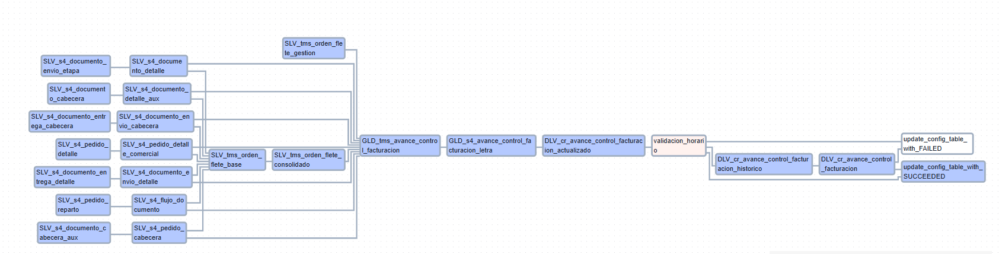

# Plantillas Custom

---

### TRANSVERSAL - ACTUALIZACIÓN CON CONDICIONALES

#### Propósito General

Orquestar la ejecución de scripts SQL en BigQuery para procesar datos relacionados con un modelo de caso de uso Alicorp. Los datos fluyen a través de 3 capas:

- **SLV (Silver):** Transformaciones iniciales y limpieza.
- **GLD (Gold):** Enriquecimiento y agregaciones.
- **DLV (Delivery):** Datos finales para consumo.

---

### Características Clave

- **Programación:**  
  Ejecución cada *n* horas (0 */n * * *).

- **Manejo de Errores:**  
  - Notificaciones por email en caso de fallos.  
  - Reintentos automáticos (1 reintento cada 2 minutos).

- **Configuración Dinámica:**  
  Generación automática de tareas basadas en `MAPPING_CARPETAS`.

- **Lógica Horaria:**  
  Ejecuta tareas históricas solo entre 00:00 y 0n:00 (hora Lima).

---

### Estructura del Flujo

#### 1. Componentes Principales

| **Elemento**                | **Tipo**                    | **Descripción**                                                                    |
|-----------------------------|-----------------------------|------------------------------------------------------------------------------------|
| `all_failed`                | `ErrorHandlerOperator`      | Actualiza estado a **FAILED** en BigQuery si se detectan fallos.                   |
| `all_success`               | `BigQueryInsertJobOperator` | Actualiza estado a **SUCCEEDED** en BigQuery si todas las tareas se ejecutan con éxito. |
| `validacion_horario`        | `BranchPythonOperator`      | Determina si se debe ejecutar una tarea histórica o marcar el éxito según la hora actual. |
| **Tareas SQL**              | `BigQueryInsertJobOperator` | 24 tareas generadas dinámicamente a partir de `MAPPING_CARPETAS`.                   |

#### 2. Capas de Datos

| **Capa** | **Descripción**              | **Ejemplos de Tablas**                                                     |
|----------|------------------------------|----------------------------------------------------------------------------|
| **SLV**  | Datos crudos transformados   | `s4_documento_entrega_cabecera`, `tms_orden_flete_base`                    |
| **GLD**  | Datos enriquecidos           | `s4_avance_control_facturacion_letra`, `tms_avance_control_facturacion`      |
| **DLV**  | Datos listos para consumo    | `cr_avance_control_facturacion_historico`                                  |

#### 3. Dependencias Clave

- **SLV_s4_documento_entrega_cabecera** → **SLV_s4_documento_envio_cabecera** → **GLD_tms_avance_control_facturacion**
- **SLV_tms_orden_flete_gestion** → **GLD_tms_avance_control_facturacion** → **GLD_s4_avance_control_facturacion_letra** → **DLV_cr_avance_control_facturacion_actualizado**

---

### Configuración Técnica

#### Variables de Entorno

| **Variable**         | **Valor**                                      | **Función**                             |
|----------------------|------------------------------------------------|-----------------------------------------|
| `EMAIL_RECIPIENTS`   | `['ext_mdelgadoa@alicorp.com.pe', ...]`        | Destinatarios de alertas.               |
| `periodo_anterior`   | Fecha del mes anterior (formato `YYYY-MM-DD`)  | Reemplazo en scripts SQL.               |

#### Seguridad

- **Impersonación de Cuentas de Servicio:**  
  Cada tarea utiliza `impersonation_chain` para ejecutar el flujo con una GSA custom que posee permisos específicos.

---

### Flujo de Ejecución

1. **Inicio:**  
   Todas las tareas SQL se ejecutan en el orden definido por las dependencias.

2. **Validación Horaria:**  
   - **Entre 00:00 y 0n:00 (hora Lima):** Ejecuta `DLV_cr_avance_control_facturacion_historico`.  
   - **Fuera de este horario:** Se salta a la actualización del estado a **SUCCEEDED**.

3. **Finalización:**  
   - **Exitoso:** `all_success` actualiza el estado en BigQuery.  
   - **Fallido:** `all_failed` registra el error y notifica.

---

### Grafo de Ejecución

#### Plantilla

> Código Fuente: 
[Descargar plantilla](../plantillas/plantilla_trans/aa_demo-template-trv-iniciativa.py)

