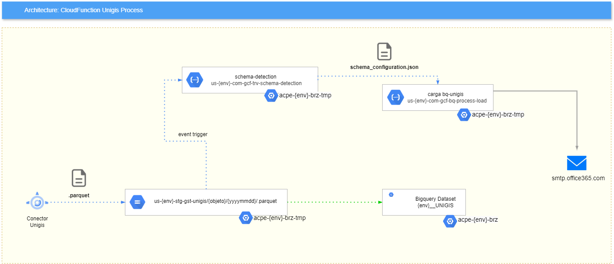

# Carga archivos .parquet a BigQuery 

## Propósito General

Orquestar la carga automática hacia BigQuery desde archivos `.parquet` depositados en un bucket de Cloud Storage.

- **Schema Detection:** `us-{env}-com-gcf-trv-schema-detection`
- **Carga BQ Unigis:** `us-{env}-com-gcf-bq-process-load`

## Consideraciones

- La extensión única aceptada es `.parquet`
- El nombre de la cabecera en los archivos debe considerar lo siguiente:
  - Solo contener letras, números y guiones bajos
  - Comenzar con una letra o guión bajo
  - Tener un máximo de 300 caracteres
- Todo campo/columna será cargado a BigQuery con tipo de dato `STRING`, a pesar de que en el archivo de carga tenga un tipo de dato diferente
- Por defecto, cada vez que se cargue un nuevo `.parquet` se añadirá como *append* a la tabla, con el nuevo contenido del archivo, pero con el mismo schema

## Arquitectura Base - Ejemplo Unigis Process

### Recursos

#### Desarrollo (dev)

| Servicio         | Nombre                                  | Proyecto          | Descripción                                                        |
|------------------|-----------------------------------------|-------------------|--------------------------------------------------------------------|
| Cloud Storage    | `us_dev_stg_gst_<iniciativa>`           | `acpe-dev-brz-tmp`| Bucket que almacena los archivos de la iniciativa asociada         |
| Cloud Functions  | `us-dev-com-gcf-trv-schema-detection`     | `acpe-dev-brz-tmp`| Función que detecta el schema del archivo cargado                  |
| Cloud Functions  | `us-dev-com-gcf-bq-process-load`          | `acpe-dev-brz-tmp`| Función que se encarga de cargar la data hacia BigQuery en la capa BRONZE |
| BigQuery         | -                                       | `acpe-dev-brz`    | Proyecto en el cual se carga la información procesada                |

#### Calidad (qa)

| Servicio         | Nombre                                  | Proyecto          | Descripción                                                        |
|------------------|-----------------------------------------|-------------------|--------------------------------------------------------------------|
| Cloud Storage    | `us_qa_stg_gst_<iniciativa>`            | `acpe-qa-brz-tmp` | Bucket que almacena los archivos de la iniciativa asociada         |
| Cloud Functions  | `us-qa-com-gcf-trv-schema-detection`      | `acpe-qa-brz-tmp` | Función que detecta el schema del archivo cargado                  |
| Cloud Functions  | `us-qa-com-gcf-bq-process-load`           | `acpe-qa-brz-tmp` | Función que se encarga de cargar la data hacia BigQuery en la capa BRONZE |
| BigQuery         | -                                       | `acpe-qa-brz`     | Proyecto en el cual se carga la información procesada                |

#### Producción (prod)

| Servicio         | Nombre                                  | Proyecto           | Descripción                                                        |
|------------------|-----------------------------------------|--------------------|--------------------------------------------------------------------|
| Cloud Storage    | `us_prod_stg_gst_<iniciativa>`          | `acpe-prod-brz-tmp`| Bucket que almacena los archivos de la iniciativa asociada         |
| Cloud Functions  | `us-prod-com-gcf-trv-schema-detection`    | `acpe-prod-brz-tmp`| Función que detecta el schema del archivo cargado                  |
| Cloud Functions  | `us-prod-com-gcf-bq-process-load`         | `acpe-prod-brz-tmp`| Función que se encarga de cargar la data hacia BigQuery en la capa BRONZE |
| BigQuery         | -                                       | `acpe-prod-brz`     | Proyecto en el cual se carga la información procesada                |

## Código Fuente

- [Schema Detection](https://github.com/Alicorp-Digital/acpe-dlk-gcf-unigis-schema-detection)
- [Carga BQ Unigis](https://github.com/Alicorp-Digital/acpe-dlk-gcf-bq-unigis-tms)
