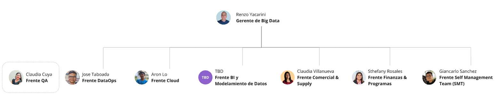

# Bienvenido a la WikiLake

¡Te damos la bienvenida a nuestro espacio central de conocimiento! Aquí encontrarás toda la información necesaria sobre procesos, proyectos, lineamientos y mejores prácticas que utilizamos en el Equipo de Big Data. Esta wiki está diseñada para ser el punto de referencia principal, de manera que puedas acceder fácilmente a la documentación y colaborar con el crecimiento de la organización.

---

## Visión

Ser el motor de la transformación **Data Driven** en la empresa, facilitando la toma de decisiones estratégicas y la creación de valor a través del análisis y la gestión inteligente de datos.

## Misión

Impulsar la captura de valor mediante la autogestión en el uso de los datos, democratizando la información de forma confiable y oportuna, para que el **uso de los datos** sea un activo fundamental para el negocio.

---

## Estructura Organizacional

A continuación, se muestra el organigrama que describe la estructura de nuestro Equipo de Big Data y sus frentes de trabajo principales.

### Roles Principales

- **Gerente de Big Data**  
  Responsable de la dirección estratégica y coordinación de todos los frentes de trabajo.

- **Frente QA**  
  Encargado de asegurar la calidad de los datos y la validación de los entregables analíticos.

- **Frente Cloud**  
  Especializado en la arquitectura en la nube, la infraestructura y la seguridad de los entornos Big Data.

- **Frente DataOps**  
  Encargado de la automatización y optimización de los flujos de datos, promoviendo la colaboración entre equipos de desarrollo y operaciones para garantizar la confiabilidad, escalabilidad y agilidad para la entrega de nuevos componentes.

- **Frente BI y Modelamiento de Datos**  
  Dedicado a la construcción de modelos analíticos y dashboards que faciliten la toma de decisiones.

- **Frente Comercial & Supply**  
  Focalizado en el relacionamiento con clientes internos y externos, así como la gestión de la cadena de suministro de datos.

- **Frente Finanzas & Programas**  
  Responsable de la planificación financiera de los proyectos y la gestión de programas de transformación digital.

- **Frente Self Management Team (SMT)**  
  Orientado al desarrollo de la cultura de autogestión y la optimización de procesos internos.

> **Nota**: Este organigrama puede variar según la evolución de los proyectos y la estructura interna del equipo.

---

## Secciones Principales

Para facilitar la navegación, hemos organizado la wiki en varias secciones. Cada sección contiene guías, procedimientos, estándares y mejores prácticas relevantes.

1. **Proyectos**  
   - Descripción de los principales proyectos de Big Data en curso.  
   - Roadmaps, objetivos y estados de avance.  
   - Metodologías de seguimiento y reporting.

2. **Procesos y Procedimientos**  
   - Flujos de trabajo para la ingesta de datos, ETL/ELT y almacenamiento.  
   - Lineamientos de aseguramiento de calidad y pruebas.  
   - Políticas de seguridad y gobernanza de datos.

3. **Herramientas y Tecnologías**  
   - Descripción de la stack tecnológica (Cloud, herramientas de BI, pipelines, etc.).  
   - Guías de instalación, configuración y mantenimiento.  
   - Recomendaciones de mejores prácticas.

4. **Guías y Tutoriales**  
   - Tutoriales paso a paso para uso de plataformas internas.  
   - Casos de uso y ejemplos prácticos.  
   - Documentación de APIs y librerías internas.

5. **Recursos y Referencias**  
   - Documentos de referencia, libros blancos y artículos recomendados.  
   - Enlaces a repositorios internos o externos.  
   - Estándares y normativas a nivel corporativo o legal.

6. **FAQ (Preguntas Frecuentes)**  
   - Respuestas a las dudas más comunes sobre los procesos y herramientas.  
   - Consejos rápidos para la resolución de problemas habituales.

---

## Contribuir a la Wiki

Nuestra wiki está en constante evolución. Para mantenerla actualizada y confiable:

1. **Proponer Cambios**: Si detectas información desactualizada o deseas agregar contenido, crea un Pull Request (o el flujo que tu organización utilice) en el repositorio correspondiente.  
2. **Revisión**: Todo cambio es revisado por el equipo de **QA** y/o el responsable del frente correspondiente.  
3. **Aprobación**: Una vez validado, se fusiona el contenido al repositorio principal y se despliega en la wiki.

> **Sugerencia**: Asegúrate de incluir referencias y ejemplos claros para facilitar la comprensión y adopción de tus aportes.

---

## Créditos y Agradecimientos

Agradecemos a todos los miembros del equipo que contribuyen diariamente a la construcción y mejora de esta wiki. Tu conocimiento y dedicación hacen posible que el Equipo de Big Data siga creciendo y generando valor en la organización.

---

## Próximos Pasos

- Revisa las [Secciones Principales](#secciones-principales) para ubicar la información que necesites.  
- Si eres nuevo en el equipo, consulta la [Guía de Onboarding](#) (enlace de ejemplo) para acelerar tu proceso de adaptación.  
- Participa en las discusiones y contribuye con tus conocimientos para que esta wiki sea cada vez más completa.

> ¡Bienvenido a la WikiLake y gracias por ser parte de esta gran aventura en Big Data!

---
